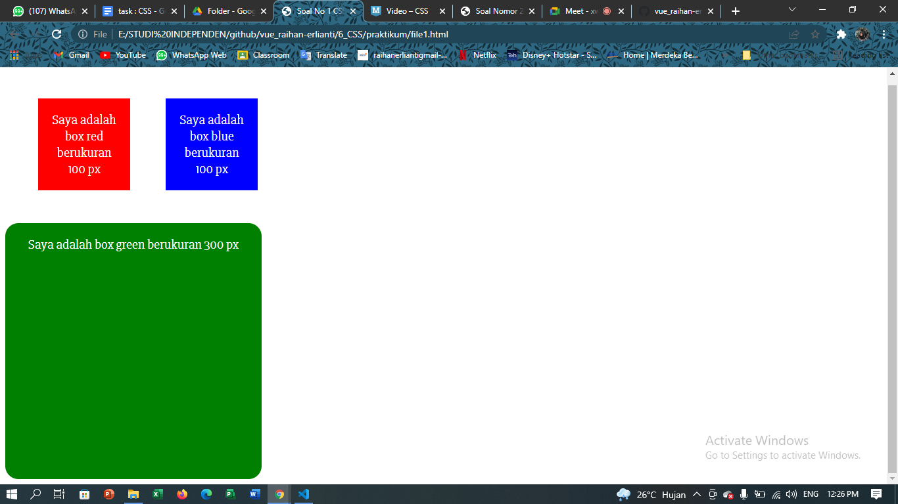
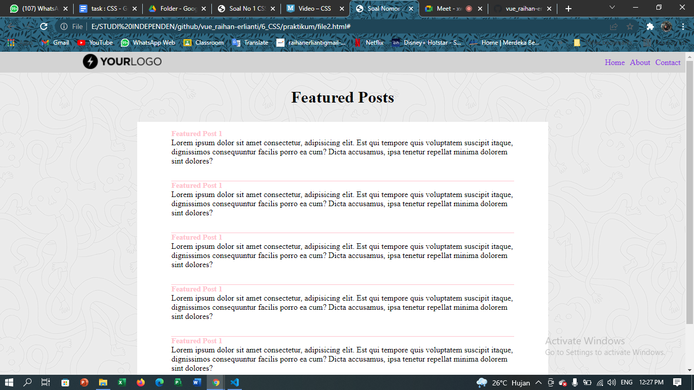
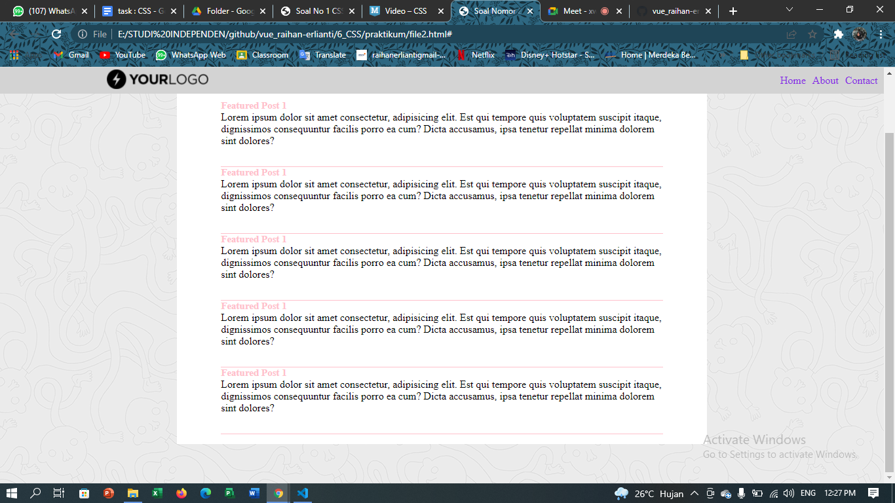

# 6 CSS

## Resume
Dalam materi ini, mempelajari :
1. Analogi CSS
2. Apa itu CSS?
3. Jenis-jenis CSS

### Analogi CSS
HTML dianalogikan sebagai kerangka rumah atau rumah yang telah dibangun dengan lengkap beserta fitur dan fungsinya. Sementara CSS dianalogikan sebagai cat temboknya, cat kusennya, perintilan-perintilan rumah yang berfungsi untuk memperindah rumah tersebut. Untuk dapat mengatur bagaimana baiknya dan menariknya rumah tersebut.

### Apa itu CSS?
CSS merupakan ankronim dari Cascading Style Sheet, dimana css ini berfungsi sebagai tools untuk menghias halaman website, ataupun dapat mengatur posisi pada halaman web. Ada 3 cara untuk memanggil atau memasukkan CSS pada halaman WEB HTML.
1. external css
2. internal css
3. inline css

### Jenis-jenis CSS?
CSS tentunya memiliki berbagai macam jenis dan bagian-bagian didalamnya. Berikut merupakan garis besar dari jenis-jenis atau bagian-bagian dari CSS.
1. CSS Selector, ini berupa Id atau Class.
2. CSS Grouping, dapat menjadikan beberapa syntax menjadi satu kelompok style.
3. CSS Font, untuk mengatur font seperti apa dan bagaimana sesuai request.
4. CSS Margins dan Padding, untuk membuat ruang di sekitar elemen.
5. CSS Background untuk menambahkan, mengedit background pada halaman yang diinginkan.
6. dan lain-lain

## Task
### Membuat project file1.html, file2.html, file2.css
Pada task ini kita akan membuat sebuah web simple yang berisi konten sederhana dengan sedikit styling didalamnya. 
Berikut kode hasil dari praktikum ini.

[file1.html](./praktikum/file1.html)
[file2.html](./praktikum/file2.html)
[file2.css](./praktikum/file2.css)

output :

