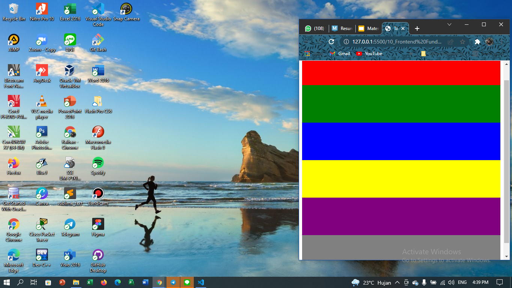
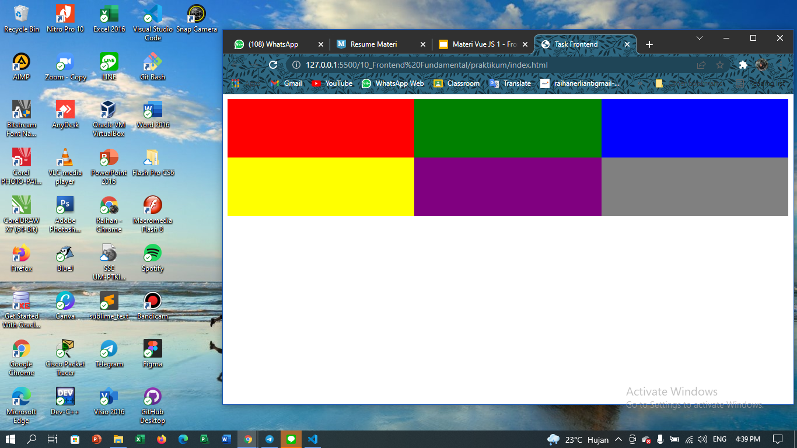
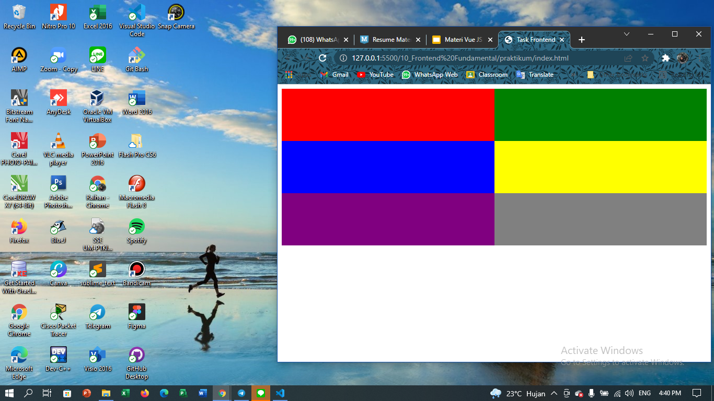

# 10 Frontend Fundamental

## Resume
Dalam materi ini, mempelajari :
1. HTML
2. CSS
3. Javascript
4. Node.js
5. NPM
6. Git

### HTML
1. Pengertian --> HTML singkatan dari Hypertext Markup Language yaitu sebuah bahasa markup yang merupakan standar untuk membuat dan menyusun halaman dan aplikasi web.

2. Cara Kerja --> diakhiri dengan ekstensi .html atau .htm, eksistensi ini bisa dirender menggunakan web browser apapun.

3. Tag --> sebuah file HTML terdiri atas serangkaian tags atau elemen.
    1. block-level = hanya berisi kontennya sendiri atau independen (ex : h1)
    2. inline tags = dapat mengisi pada elemen lain untuk 1 line (ex : span)

### CSS
1. Pengertian --> CSS singkatan dari Cascading Style Sheet yang dipakai untuk mendesain halaman depan atau tampilan website.
2. Cara Kerja --> CSS membuat style dalam halaman web yang dapat berinteraknsi dengan halaman HTML.
3. Macam CSS dalam HTML :
    1. inline CSS --> berada pada line syntax. (ex : <h1 style = "font-size:30px; color:blue;">Cek Berita Utama Ini! </h1>)
    2. internal CSS --> style berada di dalam content (head/body) menggunakan tag style.
    3. external CSS --> style berada di luar file html, dengan eksistensi .css.

    media queries --> merupakan module CSS yang berguna untuk membuat layout kita responses dengan menyesuaikan tampilan berdasarkan ukuran layar perangkat.

### JavaScript
1. Pengertian --> Script yang "membuat halaman web hidup" yang memungkinkan adanya interaksi dengan pengguna. Javascript bisa ditulis langsung kedalam kode HTML dari sebuah web dan berjlana otomatis saat halaman dimuat.
2. JavaScript Engine --> Untuk menjalankan .js beberapa website berikut memiliki enginenya seperti :
    1. Google Chrome --> V8
    2. Mozilla Firefox --> CyberMonkey
    3. Non-browser / server --> Node.JS
3. Cara Kerja --> Bisa langsung ditambahkan pada HTML menggunakan tag . Kode JS yang bisa ditambahkan :
    > diantara tag <head>
    > diamtara tag <body>
4. Pengetahuan Dasar -->
    1. Variabel = wadah untuk menyimpan/mengingat sebuah nilai. Object = kumpulan variabel dan tag nya menggunakan "{}".
    2. Operasi Matematika = memungkinkan kita untuk melakukan pengurangan, perkalian, dll. terhadap variabel dan angka.
    3. Fungsi = wadah untuk menyimpan logika atau algoritma yang dapat digunakan lagi dengan praktis.
    4. Kelas = sebuah fungsi khusus yang bisa dipakai sebagai templates untuk membuat objek dengan mudah.
    5. Kondisi = sebuah logika pemisah antara dua nilai, true dan false.
        > kondisi-if
        > kondisi-if | dengan else if
        > kondisi-switch
    6. Pengulangan = untuk melakukan pengulangan sesuai syarat kondisi yang ditentukan.
        > pengulangan-forloop
        > pengulangan-while
        > pengulangan-dowhile
        > pengulangan-foreach
        > pengulangan-map
        > pengulangan-filter
5. Aturan Nama --> 
    1. variabel = gunakan camelCase atau UPPERCASE.
    2. boolean = gunakan camelCase dan intonasi pertanyaan.
    3. function = gunakan camelCase dan awalan kata kerja.
    4. class = gunakan PascalCase dan kata benda.

### Node.js
1. Pengertian --> Node.js merupakan runtime environment untuk JS, yang berfungsi untuk menjalankan kode JavaScript dimana pun tidak hanya terbatas pada lingkungan browser.
2. Cara Kerja --> Node.js akan mengeksekusi atau menjalankan file yang bereksistensi js.

### NPM
1. Pengertian --> NPM merupakan singaktan dari Node Package Manager, yang dimana tool ini merupakan package, mengelola versi dan dependensi yang diperlukan untuk menjalankan proyek.
2. Cara Pasang --> ada pada ppt materi ini
3. Cara Kerja --> Mengatur package pada proyek yang berjalan dengan node.js
    > package pada node.js memuat semua file yang dibutuhkan sebagai module.
    > module adalah library javascript yang dapat kita masukan kedalam proyek.
3. Struktur Proyek NPM --> Untuk membuat proyek aplikasi, jalankan perintah yang ada pada ppt materi.

## Task
### Membuat project
Pada task ini kita akan membuat sebuah web simple yang berisi konten sesuai dengan templates yang telah dicontohkan.

[index.html](./praktikum/index.html)

output :

