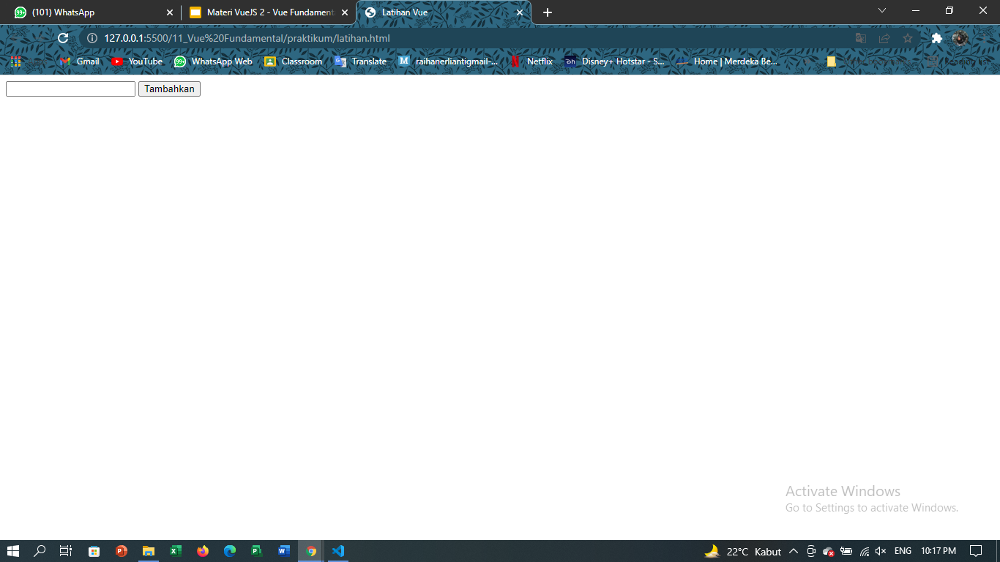
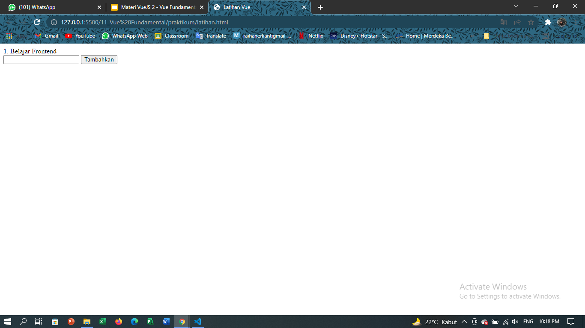
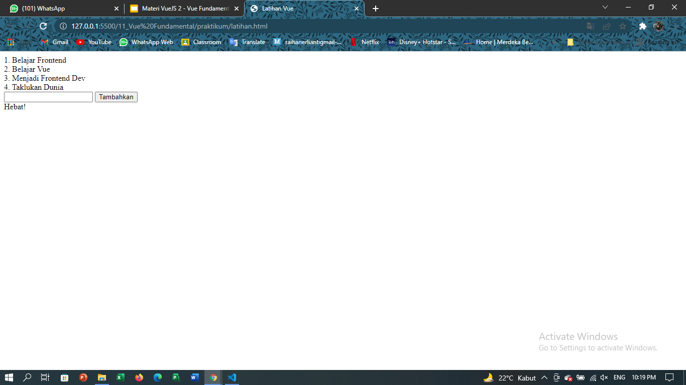

# 11 Vue Fundamental

## Resume
Dalam materi ini, mempelajari :
1. Pengenalan Vue
2. Vue Setup dan Resources
3. Dasar-dasar Vue
4. Vue Directives
5. Events dan Methods
6. Computed Properties dan Watchers
7. Component

### Pengenalan Vue
A. Apa itu Vue?
    vue adalah framework dari js untuk mengembangkan tampilan website yang lebih interaktif dan dinamis.
B. Kenapa Vue?
    1. easy to use dan mudah membuat aplikasi frontend dan website.
    2. fun atau mudah dipelajari dan menyenangkan.
    3. dokumentasi lengkap dan rapi.
    4. ramping dan cepat.
    5. populer, vue memperoleh star history di github, gitlab terbanyak hingga tahun 2020.
C. Cara Kerja
    1. Vue CDN, dqpat digunakan langsung di file HTML dengan menambahkna script dan src dari link yang dituju.
    2. Vue CLI, menggunakan perkakas standar dari ekosistem Vue untuk memudahkan setup/pembuatan aplikasi.

### Dasar-dasar Vue
A. Vue Instances
    Setiap aplikasi vue diambil dengan membuat instance vue baru dengan fungsi vue.
B Vue Data Binding
    Vue js menggunakan sintaks template berbasis HTML yang memungkinkan kita untuk secara deklaratif mengikat DOM yang dirender ke data instance vue yang mendasarinya.

    3 jenis data binding pada vue.
    1. di dalam konten, untuk menambahkan teks ke dalam konten elemen dapat mneggunakan kurung kurawal.
    2. di atribut elemen, untuk menambahkan variabel ke dalam atribut elemen dapat menggunakan v-bind.
    3. elemen HTML, untuk menambahkan HTML elemen ke dalam DOM dapat menggunakan v-html.
C. Vue Ractivity
    vue instance memiliki property bernama data, jika value dari data ada yang berubah maka value yang ditampilkan pada interface akan berubah otomatis tanpa harus dimuat ulang.

### Vue Directive
A. apa itu vue directive?
    directive adalah atribut khusus yang diawali dengan v-directive berfungsi untuk menjalankan satu perintah atau ekspresi js didalam atribut.
B. Macam Vue Directive
    1. v-bind, direktif untuk memberitahu vue kalau kita ingin melakukan oneway binding.
    2. v-model, sebaliknya dari v-bind ie dapat melakukan two way binding.
    3. v-if, v-else dan v-else-if, direktif yang digunakan untuk melakukan rendering secara kondisional.
    4. v-on, direktif untuk memberitahu vue kalau kita ingin memanggil fungsi.
C. Shorthand vue Directives 
    Khusus untuk v-bind dan v-on dapat disingkat.
D. Vue Directives yang perlu diingat
    1. directive data binding: v-bind, v-html, v-text
    2. direktif conditional: v-if, v-else-if, v-else
    3. direktif pengulangan: v-for
    4. direktif event: v-on

### Event dan Methods
    event dapat menggunakan direktif v-on untuk mendengarkan peristiwa DOM dan menjalankan beberapa JS saat dipicu.
    methods adalah fungsi yang dapat diakses secara langsung pada instance VM, atau menggunakannya dalam ekspresi direktif.
    semua metode akan memiliki konteks "this" secara otomatis terikat kedalam instance vue

## Task
### Membuat project 
Pada task ini kita akan membuat sebuah web simple yang berisi konten sesuai dengan templates yang telah dicontohkan.

[latihan.html](./praktikum/latihan.html)

output :

