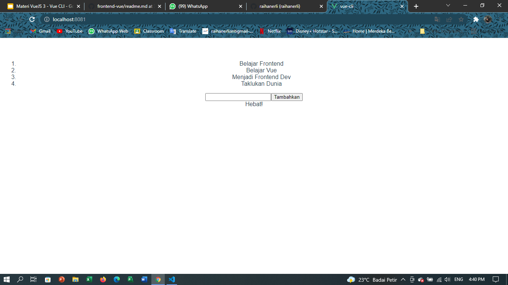

# 12 Vue CLI

## Resume
Dalam materi ini, mempelajari :
1. Vue CLI
2. Vue Komponen File Tunggal
3. Vue Struktur Folder

### Vue CLI
1. Pengertian --> Perkakas standau untuk mrmudahkan penyetelan/ pembuatan aplikasi vue baru.
    apa itu webpack? webpack adalah sebuah module bundler, digunakan untuk menggabungkan seluruh modul project aplikasi berupa file JavaScript, HTML, CSS, gambar, dan lain-lain menjadi satu file (tipe yang sama).

2. Cara Kerja -->
    a. pasang vue cli, jalankan perintah :
            ``
            $ npm install -g @vue/cli
            ``
    untuk memastikan vue cli sudah terpasang dengan baik, jalankan:
            ``
            $ vue --version
            ``
    b. inisiasi aplikasi, untuk membuat app baru, jalankan:
            ``
            $ vue create <nama aplikasi>
            ``

            ``
            $ vue create .
            ``

    lalu nanti pilihlah Default ([vue 2] babel, eslint)
    c. jalankan aplikasi, untuk menjalankan aplikasi, terdapat beberapa perintah tertulis dalam script di dalam package.json
    gunakan :
            ``
            $ npm run serve
            ``
    setelah selesai melakukan proses kompilasi dan tidak ada yang error, akan ada log informasi alamat aplikasi kita dapat diakses.

### Vue Komponen File Tunggal

1. Pengertian --> Komponen file tunggal memungkinkan kita membangun seluruh komponen (struktur, gaya, dan fungsi) dalam satu file. Komponen file tunggal memiliki eksistensi .vue.

2. Cara Kerja --> terdapat 3 tag utama pada komponen file tunggal yaitu :
                    1. <template>, sama seperti html body, memuat dan me-render HTML tag pada umumnya.
                    2. <script>, memuat syntax javascript juga dapat menerima atribut lang yang biasanya untuk penggunaan type script.
                    3. <style>, memuat syntax css. juga dapat menerima atribut lang yang biasanya untuk penggunaan CSS preprosessor seperti Stylus SCSS.

### Vue Struktur Folder

1. Default/Bawaan --> pada dasarnya, direktori yang kita pilih dengan setelan bawaan akan sesuai standar, seiring berkembangnya aplikasi dan bertambah kompleksnya aplikasi, maka susunan direktori bisa berubah sesuai keinginan.

2. Assets --> di direktori ini kita akan menyimpan semua file di asset. (seperti font, ikon, gambar, style, dll)

3. Components --> di direktori ini kita akan menyimpan semua file komponen file tunggal Vue.

4. Router --> didalam direktori ini kit akan menyimpan semua file yang terkait dengan vue-router, yang dimana ini merupakan library untuk mengatur routing alamat aplikasi vue.

5. Store --> ini adalah direktori penyimpanan vuex tempat kita dapat menyimpan semua file terkait vuex. vuex adalah library untuk mengatur penyimpanan state berbasis global pada aplikasi vue.

6. View --> isinya mirip dengan direktori komponen, yaitu komponen file tunggal namun yang membedakan adalah pada direktori ini dibunakan sebagai halaman, dimana file di dalam direktori ini berhubungan langsung dengan router. Sedangkan file di direktori components berhubungan langsung dengan file di direktori views atau sesama file di folder components.

7. Test --> direktori test berada diluar direktori src, krn direktori ini tidak berhubungan dengan file yang dibutuhkan untuk proses pengembangan. Berisi berkas untuk melakukan unit testing komponen atau fungsi yang ada didalam direktori src.

## Task
### Membuat project
Pada task ini kita akan membuat sebuat todo list menggunakan komponen file tunggal.

[App.vue](../vue-cli/src/App.vue)

output :

