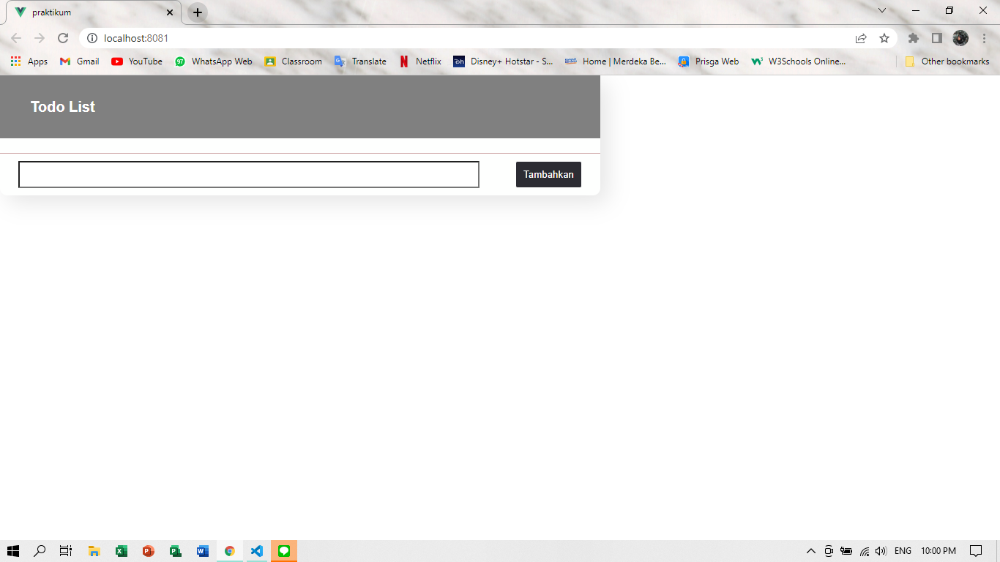
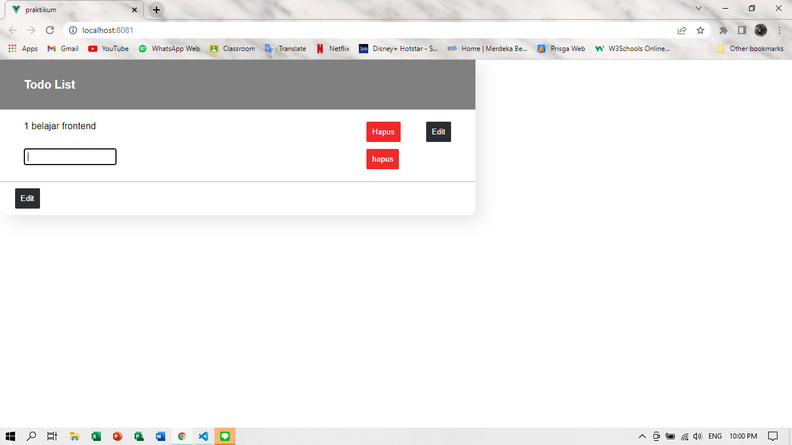
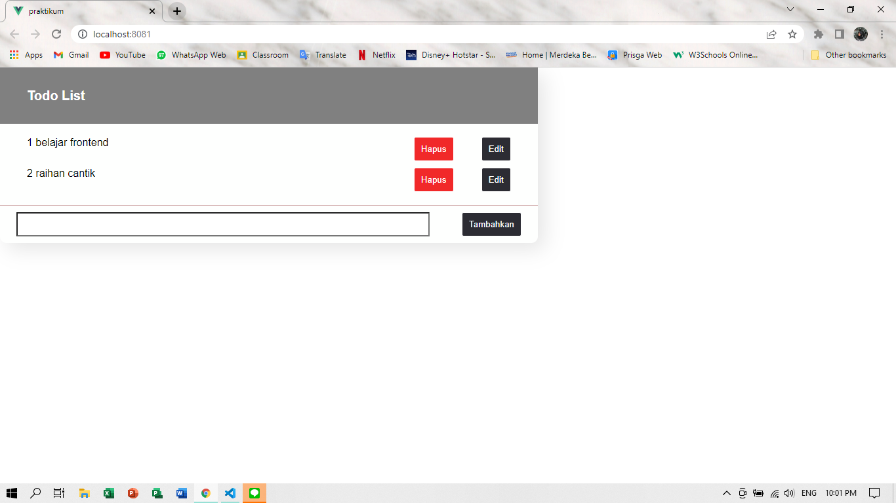
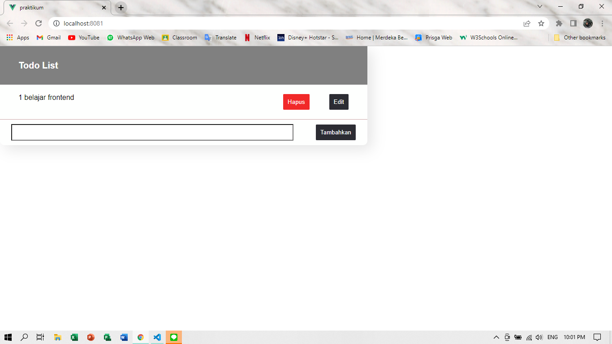

# 14 Vue Helper

## Resume
Dalam materi ini, mempelajari :
1. Navigasi Pada Vue
2. Layout Template Vue
3. Penyimpanan Global
4. Penyimpanan Global Permanen

### Navigasi Pada Vue
1. Pengertian = kegiatan berpindah dari dari satu halaman ke halaman lain. pada dasarnya, vue adalah single page application yaitu yang hanya memiliki satu entry dalam HTML saja. selebihnya dirender ulang dgn bantuan javascript.

2. Cara Kerja = untuk dapat berpindah ke halaman yang kita inginkan, pertama yang harus dipastikan adalah halaman tersebut ada.

### Layout Template Vue

1. Pengertian = susunan tata letak, sedangkan layout template pada vue adalah komponen yang dapat dipakai sebagai susunan tata letak dasar yang membungkus masing masing halaman. layout juga dapat diterapkan untuk mengisolasi logika tampilan viewport supaya kode di setiap halaman tetap bersih dan efisien.

2. Cara Kerja = komponen biasa, namun ia dapat meneruskan konten dari anak komponennya.

### Penyimpanan Global

Pengertian = penyimpanan global adalah sebuah metode untuk menyimpan variable yang dapat di akses dengan mudah di seluruh bagian aplikasi.

state komponen
props
store

1. Vuex = adalah pola manajemen penyimpanan atau store yang berbentuk pustaka untuk aplikasi vue.js. vuex mutations berfungsi untuk memodfikasi nilai dari state yang tersimpan di dalam store mnggunakan sintaks mutation.

2. Mutations = hanya bertujuan untuk mengubah nilai variable yang ada di dalam store tanpa ada logika pengolahan muatan di dalam fungsi mutation tersebut.

3. Vuex actions = bertugas seagai pintu masuk perintah yang menghubungkan komponen dengan store,actions perlu memanggil fungsi di mutations untuk memodifikasi nilai state yang ada di store. selain itu, action juga tempat untuk melakukan komunikasi dgn API.

## Task
### Membuat project
Pada task ini kita akan membuat sebuah todo list yang di lengkapi dengan tombol hapus dan edit.

[App.vue](../14_Vue%20Helper/praktikum/src/App.vue)

output :

