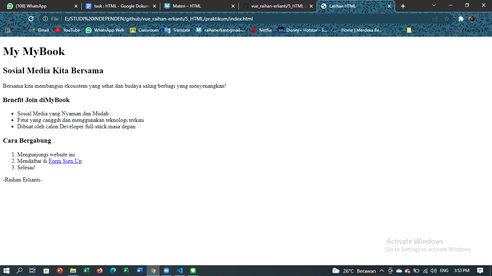
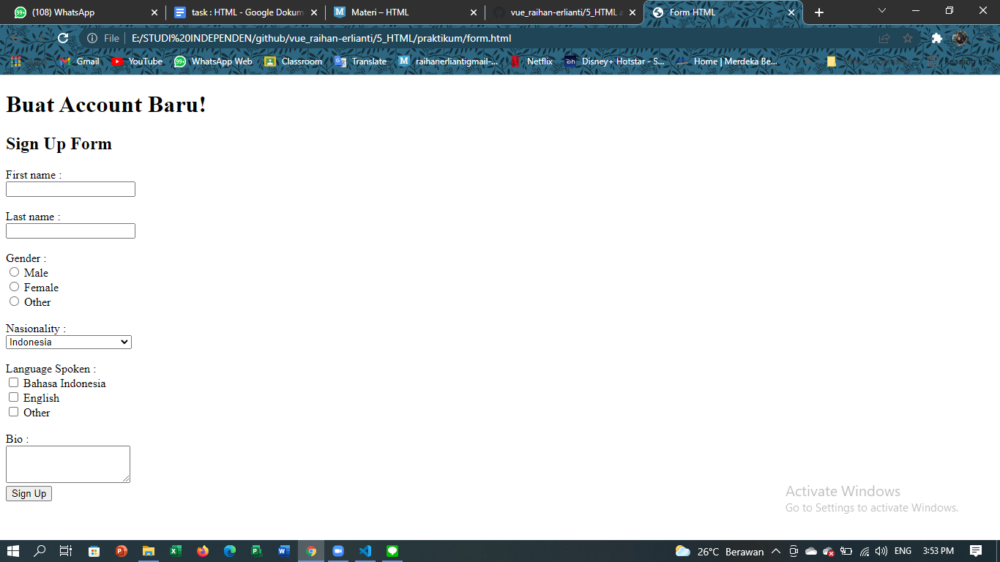
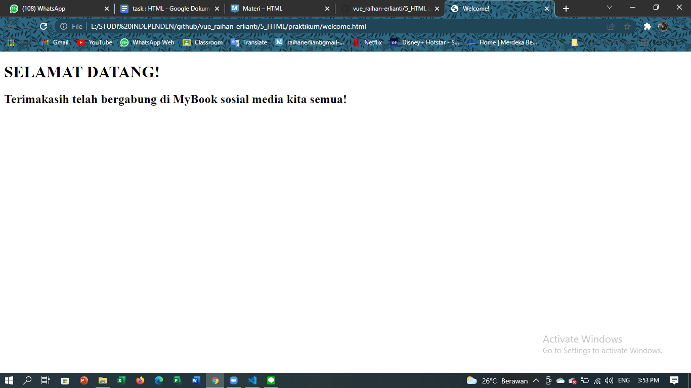

# 5 HTML

## Resume
Dalam materi ini, mempelajari :
1. Apa itu Front-end?
2. Apa itu HTML?
4. Apa saja HTML editors?
5. Contoh-contoh tag HTML

### Apa itu Front-end?
Front-end merupakan sebuah istilah it dimana pekerjanya berhadapan langsung dengan usernya, maksudnya frond-end itu terjun langsung dalam tampilan sebuah website, membuat tampilan agar menarik di mata user tersebut. Berbeda dengan back-end yang ada dibalik layar mengerjakan database dan lain-lainnya.

### Apa itu HTML?
HTML merupakan akronim dari Hypertext Markup Language yang merupakan sebuah standar yang digunakan untuk membangun komponen-komponen untuk sebuah website.
Kegunaan - kegunaan lainnya yaitu :
1. membuat struktur halaman website
2. mengatur tampilan dan isi website
3. membuat table dengan tag HTML table
4. membuat form HTML
5. membuat gambar dengan canvas
6. mempublikasikan halaman web dengan online

### Apa saja HTML editors?
HTML editors antara lain, ada :
1. notepad
2. visual studio code
3. sublime
4. notepad++
5. dan lain-lain

### Contoh-contoh tag HTML
1. ada <!DOCTYPE html>, ini berada pada baris pertama dalam txt editor html, yang berfungsi untuk mendefinisikan dokumen ini sebagai HTML5
2. lalu ada tittle yang berfungsu untuk menamai halaman website tersebut pada tabnya
3. tag div berfungsi untuk mengelompokkan komponen dalam 1 kelompok kelas
4. tag heading dan paragraf digunakan untuk mengedit sebuat teks, heading untuk judul pada teksnya, dan paragraf digunakan untuk teks isinya.
5.  merupakan tag untuk memberi link pada sebuat kata, kalimat dalam suatu website.
6.  biasanya untuk memasukan gampar atau foto kedalam website kita.
7. tag list untuk membuat list, ada orderlist ada unordered list yang berbeda hanya cara pengurutan nya saja.
8. tag table untu membuat tabel pada HTML
9. tag form untuk membuat formulis atau angket pada html 

## Task
### Membuat project index.html, form.html, dan welcome.html
Pada task ini kita akan membuat sebuah web simple yang hanya berisi isi komponen yang sering digunakan untuk website-website lainnya.

Berikut kode hasil dari praktikum ini.

[index.html](./praktikum/index.html)
[form.html](./praktikum/form.html)
[welcome.html](./praktikum/welcome.html)

output :

