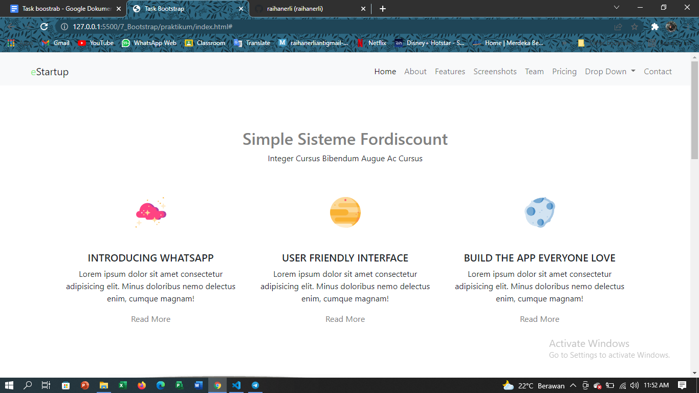
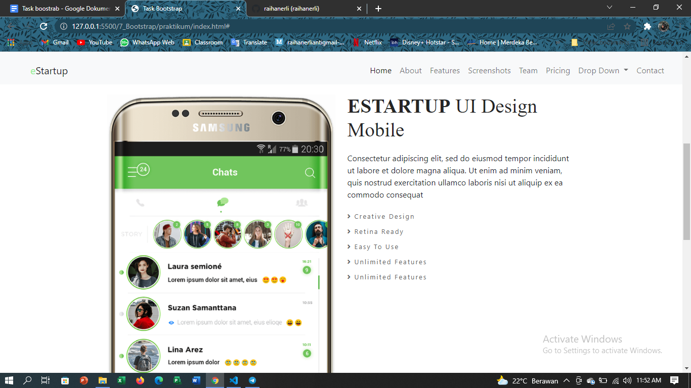
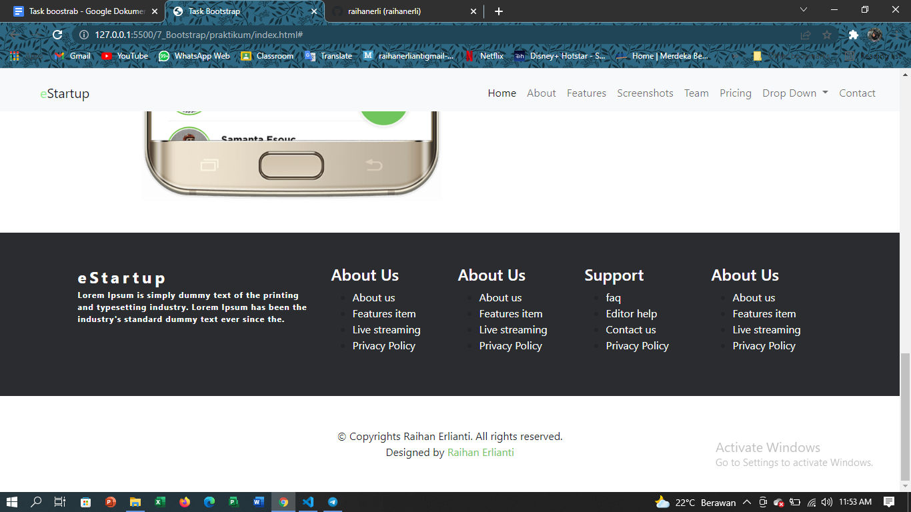

# 7 Bootstrap

## Resume
Dalam materi ini, mempelajari :
1. Apa itu Bootstrap?
2. Head
3. Body

### Apa itu Bootstrap?
Bootstrap merupakan framework dan kerangka kerja CSS yang sumbernya terbuka dan bebas untuk merancang situs web dan aplikasi web. Template desain berbasis HTML dan CSS.

Berikut merupakan cara penggunaan bootstrap :
1. Type bootstrap di google dan klik bootstrap.
2. Didalam situ terdapat banyak templates yang dapat digunakan secara cuma-cuma.
3. Jika telah menemukan templates yang sesuai, maka dapat kita copy codenya dan paste pada tempat yang kita inginkan.
4. Edit codenya dan sesuaikan dengan kebutuhan kita.

Bahasan selanjutnya akan membahas komponen yang biasanya digunakan untuk sebuah website pada bootstrap.

### Head
Pada head ini berisi code-code yang biasanya digunakan untuk judul sebuah website, sumber atau source-source, pemanggilan style.css, dan lain sebagainya.

### Body
Pada body ini berisi main code dari seluruh coding yang telah kita buat. Berisi konten yang dapat kita tata dan rapikan tata letaknya. lalu dapat dirapikan secara keseluruhan dan detail pada style.css.

Footer pun merupakan bagian dari body.

## Task
### Membuat project 
Pada task ini kita akan membuat sebuah web simple yang berisi konten sesuai dengan templates yang telah dicontohkan.

[index.html](./praktikum/index.html)

output :

